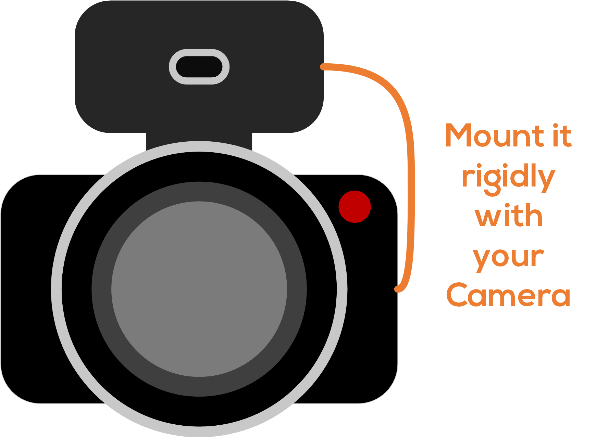
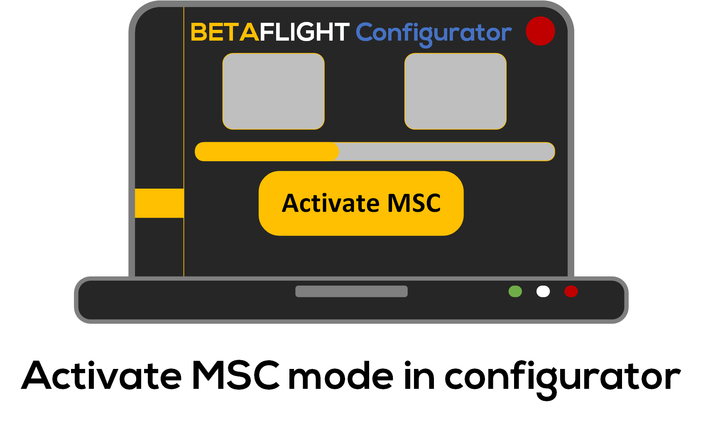
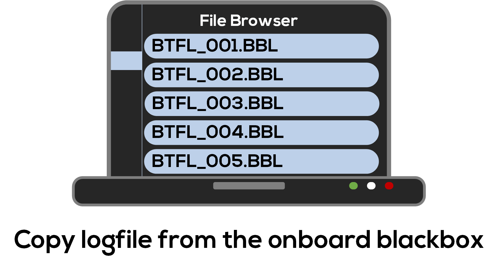

# Quick Start for Flowshutter
This page assumes that you are using a commercial version of Flowshutter (depending on the manufacturer, it may be called differently, such as "stabilization box", "stabilization data box", "flowshutter box", etc), these commercial hardwares often contain a flowshutter board and a betaflight flight controller, as a whole. On this page we refer to these wholes as **Flowshutter**.

If you are using a DIY flowshutter, then you should clearly separate your flight controller from the flowshutter, and carefully consider the specific configuration of the corresponding parts in this tutorial on your own build.

## Meet the hardware

Although hardware from different manufacturers varies, their main components should be the same - necessary parts of the flowshutter device/firmware to work properly.

At the time of writing this page, I only have the commercial version of NeutronRC hardware - **NeutronRC SDB**, so this page will give you a quick start based on that.

### OLED screen

Flowshutter currently only support a single OLED screen, with 128x32 pixels.

### Buttons

Flowshutter requires two physical buttons to complete the interaction, they are the **PAGE** button and the **ENTER** button

### Camera control port

Flowshutter's control of the camera is achieved through the connection of physical wires to transmit control signals. So in order to be able to control your camera properly, you should use this port to properly connect with the camera's control interface.

### Flowshutter USB (Charge/ESP32 USB)

This interface is used to upgrade the flowshutter firmware. 

!!! note ""
    Please note the difference between "Flowshutter" and "flowshutter", the former is a physical entity, and the latter refers specifically to the firmware.

### FC USB (Flowbox USB)

This interface is use to configure the flight controller (motion data logger), and export motion data.

## Mount it to your camera

Please mount Flowshutter rigidly to your camera. For use in high-vibration environments (such as a large X8 drone), be sure to take vibration reduction measures for the camera as a whole.

You may have concerns about the installation orientation, but it doesn't matter, we have many flexible ways to offset the impact of different installation orientations. The easiest way will be introduced in the next section.

## Config it for your camera

### Select camera protocol

### Select device mode

### Reboot device

### Config logger part

1. Connecting FC to computer, open betaflight configurator and connect to FC (flowbox)
2. Change orientation in `Configuration` tab, until the drone's movement matched up with your camera movement in `Setup` tab.

## Exatracting motion data

### Connecting FC to computer

### Activating MSC mode

In configurator, `Blackbox` tab, click `Activate MSC` button.

### Copy motion data

Then the FC will become a readable USB drive, and you can copy the motion data from it to your computer.

## Flash firmware

For some special reason, it may be necessary to flash a new firmware in some cases, such as:

- New firmware adds control support to your camera
- The new firmware has features you desperately need
- The new firmware fixes a bug you're currently experiencing

The following will briefly introduce the steps of firmware upgrade for you in the simplest way.

### Flash flowshutter firmware

1. Download uPyCraft IDE
2. Download flowshutter firmware from [GitHub release](https://github.com/gyroflow/flowshutter/releases)
3. (Optional) Download and install CH340 driver for your computer
4. Open uPyCraft IDE
5. Connect Flowshutter USB to your computer
6. `uPyCraft IDE` -> `Tools` -> `BurnFirmware`
7. Configure burning parameters as below:

8. Hit `OK` and wait until it finishes 

### Flash FC firmware

1. Download betaflight configurator from [Betaflight configurator release](https://github.com/betaflight/betaflight/releases)
2. Connect your FC (flowbox) to your computer
3. `Firmware Flasher` tab -> `STM32F411` -> `4.3` -> `Load Firmware [Online] ` -> `Flash Firmware`
4. Add gyroflow `logger-presets` as third party preset source. Check [this page](/docs/logging/betaflight.md) and/or [this page](/docs/logging/flowbox.md) for more information.
5. Connect to FC -> `Presets` tab -> pick and apply the cooresponding `gyroflow preset` for your device, e.g. **NeutronRC SDB** should pick `NeutronRC SDB` preset.